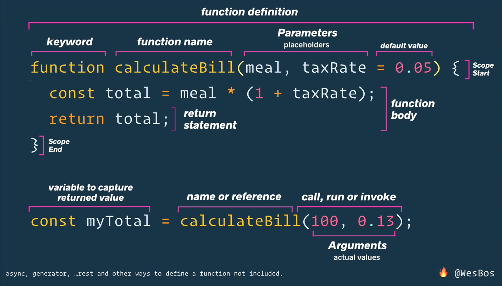
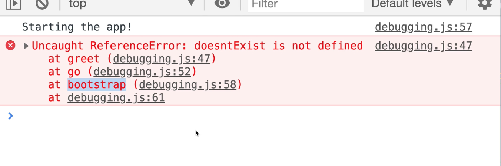
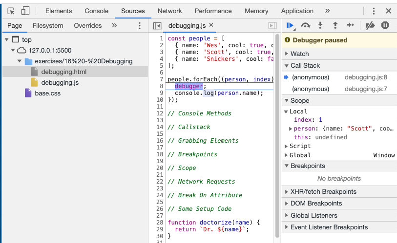
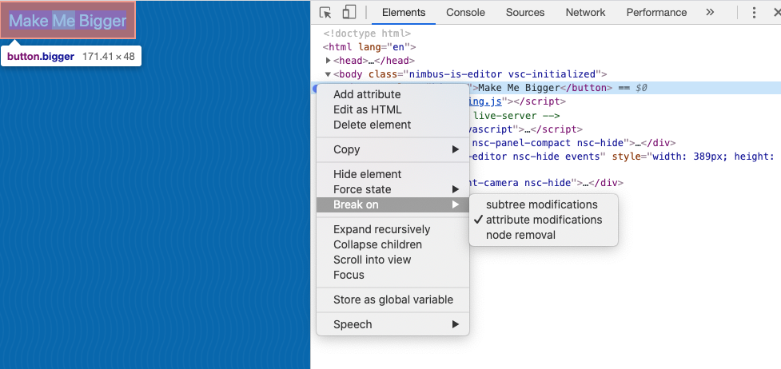

# Beginner JavaScript - Wes Bos

## Variables & Statements

- "use strict" at the top of your JS enforces some best practice
- var is function scoped
- let and const are block scoped
- variables should not start with a capital letter - unless they are a Class
- can start with letter, \$ and \_
- camel case is best or snake case (i_like_variables) but not hyphens
- Wes' eslint setup - [checkout his repo](https://github.com/wesbos/eslint-config-wesbos)
- [eslint](https://eslint.org/)
- [prettier](https://prettier.io/)
- you can edit the rules in your .eslintrc to remove rules you don't like
- /_ eslint-disable _/ will disable eslint

## Module 1: Types

- seven types

  1. String
  2. Number
  3. Object - everything in JS is an object
  4. Boolean
  5. Null
  6. Undefined
  7. Symbol

### Strings

- escape a character in strings with \
- concatentation is when you combine two strings
- interpolation is when you add a variable into the string
- backticks makes things easier:
  const hello = `hello my name is ${name}. Nice to meet you`;
- great for HTML
- typeof variableName to find out the type of variable
- is loaded because with a string it will concatenate rather than do maths

### Numbers

- modulo returns the number left over after 2 numbers are divided
  10 % 3 // 1
- dealing with floats can be tricky - dealing with money its best to go with just cents
- you can also hit a limit with what a computer can calculate
- NaN - not a number

### Objects

- good for grouping things together
- object basically contains sub variables
- dot notation is the easiest way to access object properties

### Null & Undefined

- undefined is a variable that has been created with no value
- a variable created by not defined
- Null is a value of nothing
  const nothing = null;

### Boolean & Equality

- true or false
- great for conditional statements
- == is generally a bad idea
- best to use === triple equals
- triple equals checks the value and type of the variable

## Module 2: Functions

- functions let us group together sets of statements
- functions can take in data - arguments
- they perform some work - statement
- often they return a value/some data - not all of them return something (returns undefined)
- [MDN is our best reference for all things JS](https://developer.mozilla.org/en-US/docs/Web/JavaScript/Guide/Functions)
- lots of built in functions in JS:
  - Math.max() Math.floor()
  - parseFloat('20.33234'); // returns a number
  - parseInt('20.33234'); // returns 20
  - Date.now(); // number of milliseconds since Jan 1 1970 (epoch.now.sh)
  - document.querySelector('p'); // DOM functions
  - navigator.vibrate(200); // effects mobiles
  - window.scrollTo(0,200); // scrolls to 200px down the page
  - scrollTo({ top: 600, left: 0, behavior: 'smooth'}); // you can pass an object to a function as well

### Custom Functions

- functions can do anything
- they take in values and return something
- functions are defined and called
- the curly braces form the function block
- we need to return something from a function to access it outside the function

```js
// Function definition
function calculateBill() {
  // this is the function body
  console.log("running calculateBill");
  const total = 100 * 1.13; // temporary variable (only exists in this function - gone once run)
  return total; // need to return total to access it outside of the function
}

// function call or run
const myTotal = calculateBill(); // need to assign this to a variable to capture the result
console.log(myTotal); // now we can access it

// OR

console.log(`Your total is $${calculateBill()}`); // can run the function directly inside of our backticks
```

- we need to assign our returned value to a variable to capture the result
- variables within a function are only temporary as the function runs

### Functions - Parameters & Arguments



- not always great to reach outside of your function for data
- better to pass into our function the data we need
- when you define a function you can add parameters - these are like placeholders in the function
- then when you run it you add the arguments for these parameters

```javascript
// Function using parameters
function calculateBill(billAmount, taxRate) {
  const total = billAmount * (1 + taxRate);
  return total;
}

const myTotal = calculateBill(100, 0.13);
console.log(`Your total is $${myTotal}`);

// You can also add expressions for the arguments

const myTotal2 = calculateBill(20 + 40 + 30 + 50, 0.13);
```

- the parameters are temporary variables
- you can assign your arguments with other variables but the function just sees the values

```javascript
function sayHiTo(firstName) {
  return `Hello ${firstName}`;
}
const greeting = sayHiTo("John"); // returns John
const greeting2 = sayHiTo(); // returns undefined
```

- if you define a firstName variable outside of the function then the function will using that if no argument is added
- you can reuse the same parameter name in two different functions and they don't clash as they are scoped to their own functions

```javascript
function doctorize(name) {
  return `Dr. ${name}`;
}

function yell(name) {
  return `HEY ${name.toUpperCase()}`;
}

// you can pass another function into a function
yell(doctorize("john")); // returns HEY DR. JOHN
```

- its a good idea to add a **default** to your parameters just in case the argument isn't added

```javascript
function calculateBill(billAmount, taxRate = 0.13) {}

// OR just use an empty string so the function doesn't error out
function yell(name = "") {
  return `HEY ${name.toUpperCase()}`;
}
```

- if you don't want to use the default you need to add undefined as the argument

### Different Ways to Declare Functions

- functions are first class citizens because they are values
- this means they can be passed into other functions, stored in variables, handled and moved around
- not true for other languages
- lots of ways to write our functions

```javascript
// Function Declaration
function doctorize(firstName) {
  return `Dr. ${firstName}`;
}

// anonymous function - good for callbacks
function(firstName) {
  return `Dr. ${firstName}`;
}

// Function Expression
const doctorize = function(firstName) {
  return `Dr. ${firstName}`;
};
```

- Arrow functions can also be written in a number of ways
- nice and concise syntax
- don't have their own scope in relation to 'this' keyword
- arrow functions are always anonymous functions

```javascript
// 1. start with normal function
function inchToCM(inches) {
  const cm = inches * 2.54;
  return cm;
}

// 2. shorten this to
function inchToCM(inches) {
  return inches * 2.54;
}

// 3. convert to function expression in prep for arrow function
const inchToCM = function(inches) {
  return inches * 2.54;
};

// 4. convert to arrow function - remove function keyword and add fat arrow after parameter brackets
const inchToCM = (inches) => {
  return inches * 2.54;
};

// 5. implicit return - quick little one-liner
// remove curly brackets and return keyword
const inchToCM = (inches) => inches * 2.54;

// 6. with one parameter you can remove the brackets
const inchToCM = (inches) => inches * 2.54;
```

```javascript
function add(a, b = 3) {
  const total = a + b;
  return total;
}

// above as arrow function
const add = (a, b = 3) => a + b;
```

- need to be careful of curly brackets when turning an object
- in this example we add brackets around the curly brackets

```javascript
// regular function
function makeABaby(first, last) {
  const baby = {
    name: `${first} ${last}`,
    age: 0,
  };
  return baby;
}

// as arrow function
const makeABaby = (first, last) => ({ name: `${first} ${last}`, age: 0 });
```

- most likely the regular function was better and more readable in this case

### IIFE

- immediately invoked function expression

```javascript
(function() {
  console.log("Running the anon function");
  return "You are cool!";
})();
```

- wrapping the function inside of brackets followed by () runs it immediately
- good for function scoping out code

### Methods

- a method is a function that lives inside of an object
- for example console is an object & log is a method on that object

```javascript
const wes = {
  name: "Wes Bos",
  // Method
  sayHi: function() {
    console.log("Hey Wes");
    return "Hey Wes";
  },
  // Shorthand method
  yellHi() {
    console.log("HEY WESSSS!");
  },
  // arrow function
  whisperHi: () => {
    console.log("hii mess im a mouse");
  },
};
```

- here is our sayHi method inside of our wes object
- we can also write our method using the above shorthand way removing the function keyword and colon

### Callback function

- callback functions let us run another function inside our function
- called by the browser after we run our initial function

```javascript
const button = document.querySelector('.clickMe');

function yellHi() {
  console.log('HEY JOHN');
  return `HEY JOHN`;
}

button.addEventListener('click', yellHi);

// Or call a function inside our function
button.addEventListener('click', function() {
  console.log('Nice job');
}
```

### Timer call

```javascript
setTimeout(yellHi, 1000); // runs after 1 sec

// or with an anonymous function
setTimeout(function() {
  console.log("Done");
}, 1000);

// or with an arrow function
setTimeout(() => {
  console.log("Done");
}, 1000);
```

### Debugging Tools

#### Console Methods

- we have a number of console methods we can use:
  1. console.log
  2. console.error - styles return differently
  3. console.warn - styles return differently
  4. console.table - formats return in a table
  5. console.count shows how many times your function is running
  6. console.group & console.groupEnd lets you group a number of console methods together

#### Callstack ( or stack trace )

- the callstack shows the trace of how an error happened
- it allows you to follow it back to its source



#### Grabbing elements

- when inspecting an element in the browser you can swtich to the console once something is inspected then type \$0 to expect that element and any of its methods
- \$('p') will do a document.querySelectorAll in the browser from the console
- useful of inspecting elements

#### Breakpoints

- adding breakpoints in our code pauses the code at that point and lets us inspect what it going on at that moment in time within our function

```javascript
people.forEach((person, index) => {
  debugger; // just add this at the point we want it to stop
  console.log(person.name);
});
```

- then in the Sources tab in our developer tools we can step through, see our call stack and lots of other bits of info
- you can step it forward, switch to view the console then switch back and step it forward again

  

- you can also add a debugger breakpoint in the Sources tab by clicking on the line in your script where you want to add one

#### Network Requests

- Network tab is useful for seeing all the different elements being loaded onto a site
- you can click on each one and see timing, cookies, header etc
- you can see external calls and how long they might be taking

#### Break On Attribute

- this can let you add a break on and element, say a button for example, then when you click the button it will take you to the part in the script that it firing on button click
- inspect the element then click the dots next to it in the Elements tab and choose Break On and select Attribute modification

  

- in the Sources tab you can also add breakpoints at Event Listener (whenever someone clicks a button) or EHR/Fetch (fetches some external data) breakpoints as well

## Module 3: The Tricky Bits

### Scope

- scope is about where my variable and functions are available to me
- a global variable is available anywhere in the browser, in any script file on the page
- global variables can cause issues
- a global scope like setInterval is attached to the window object
- with **function scope** variables declared inside of a function are only available within that function
- **scope lookup** is when a function runs and looks for a variable, if it can't find it within the function it will move up a level
- so a variable declared outside of a function is available to that function
- you can use the same name for a variable declared inside of a function that's the same as a variable outside of the function but its generally not a good idea

#### Block scope

- const and let declared inside of a block {} is not available outside of the block. A var is available outside of the block
- var variables are still function scoped though

- try not to create global variables
- a function inside of another function is scoped to that function

### Hoisting

- hoisting in JS allows you to access functions and variables before they have been created
- function declarations and variable declarations are hoisted
- the compiler moves all these functions and variable to the top so you can call them anywhere

```javascript
// you can call the function here above and it will work
sayHi();

function sayHi() {
  console.log("hey!");
}

// this one won't work
const add = (a, b) => a + b;
```

- with variable hoisting it pulls the variable declaration to the top but not necessarily the value - can cause issues

## Closures

- a closure gives you access to an outer function’s scope from an inner function
- being able to access a parent level scope from a child scope even after the parent has been terminated

```javascript
// example of a closure
function outer() {
  const outerVar = "Hey I am the outer var";
  function inner() {
    const innerVar = "Hey i am the inner var";
    console.log(innerVar);
    console.log(outerVar); // can do a scope lookup to get this variable
  }
  return inner;
}

const innerFn = outer(); // the outer function has already run
innerFn(); // but here we are still getting access to it from the inner function
```

- the trick here is that the inner function still has access to the outerVar despite the fact that it has already run so technically that variable should have been cleaned up and removed
- so the child maintains access to that outerVar variable this is whats called a closure
- as long as the child function has references the variable from the parent that parent variable continues to exist as part of this closure

```javascript
function init() {
  var name = "Mozilla"; // name is a local variable created by init
  function displayName() {
    // displayName() is the inner function, a closure
    alert(name); // use variable declared in the parent function
  }
  displayName();
}
init();
```

## Module 4: The DOM - Working with HTML & CSS

### The DOM

- the DOM is our Document Object Mode - a tree like structure of all our elements on our page
- with JavaScript we can interact wit the DOM
- our **window** object is our global scope
- so in our console on any webpage we can do **window.location** and open up an object with a whole lot of info about the page
- you can do things like **innerWidth** or **innerHeight**
- the window is everything about the currently open browser window
- inside the window we have the document object - this is everything between the opening and closing html tags
- the **navigator** is a level up above the window and gives you device info

### Element Properties and Methods

- we load our js at the bottom of the page so all the other elements have been loaded and parsed by the browser
- first thing we need to do is select our element before we can do something with it
- two main ways we select elements is:

```javascript
const p = document.querySelector("p"); // selects the first p element it finds
const div = document.querySelectorAll("div"); // returns all the div's it finds as a NodeList

const img = document.querySelectorAll(".item img"); // specify the image

const item2 = document.querySelector(".item2"); // class name
const item2Img = item2.querySelector("img"); // then grab the img on item2 - search inside that selector - limits the scope

// still options like, but easier to just use querySelector an querySelectorAll:
document.getElementById("idname");
```

- a NodeList is a list of elements but its not an array - sort of looks like one though

### Element Properties and Methods

- [mdn element reference](https://developer.mozilla.org/en-US/docs/Web/API/Element)
- if we do a console.dir on an element we get the object properties, methods
- this shows lots of helpful properties you can run on that object
  - parentElement
  - textContent
- you can use these as getters and setters

```javascript
const heading = document.querySelector("h2");

heading.textContent = "John is cool"; // setter
console.dir(heading.textContent); // getter

console.log(heading.innerHTML); // logs any html tags within the selected element
console.log(heading.outerHTML); // logs any html tags outside the selected element too

pizzaList.insertAdjacentText("beforebegin", "more text"); // adds text onto an element at different points - faster than textContent
```

### Working with Classes

- we can use classList on an element to give us info on classes on that element and what else we can do with classList
- looking in the prototype shows us some methods we can use: add, remove, toggle, contains
- we often use something like this to animate an element by changing the class

```javascript
const pic = document.querySelector(".nice");

function toggleRound() {
  pic.classList.toggle("round");
}

pic.addEventListener("click", toggleRound);
```

### Build in and Custom Data

- we can access and alter all the attributes on an element
- a lot of these are getters and setters

```javascript
pic.alt = "clouds";
pic.width = 200;

pic.setAttribute("alt", "cute pup"); // similar to .alt
console.log(pic.getAttribute("alt"));
```

- setAttribute actually lets you add no standard attributes to an element, but this is bad practice. Its better to use a data- property on the element instead

```javascript
// 

const custom = document.querySelector(".nice");
console.log(custom.dataset); // returns all the data- attributes
```

- good for adding click events to specific elements
- nice example of adding a larger version of the image path in a data attribute to switch between

### Creating HTML

- common way to add content to a page is with createElement method and appendChild.

```javascript
const myPara = document.createElement("p");
myPara.textContent = "I am a P";
myPara.classList.add("special");

const myImage = document.createElement("img");
myImage.src = "https://picsum.photos/500";
myImage.alt = "Nice photo";

const myDiv = document.createElement("div");
myDiv.classList.add("wrapper");
```

- when you've created a number of elements you can add them to the DOM with appendChild

```javascript
myDiv.appendChild(myPara);
myDiv.appendChild(myImage);

document.body.appendChild(myDiv);
```

- its best to create the elements and build them up before adding them to the DOM to save on repaints
- append is a newer option but best to check browser support
- insertAdjacentElement is another option with fine control for inserting an element

```javascript
// this is the syntax
targetElement.insertAdjacentElement(position, element);
```

- Positions available are:
  - 'beforebegin': Before the targetElement itself.
  - 'afterbegin': Just inside the targetElement, before its first child.
  - 'beforeend': Just inside the targetElement, after its last child.
  - 'afterend': After the targetElement itself.

### HTML from Strings and XSS

- you can create HTML with innerHTML which adds it as a string.

```javascript
const item = document.querySelector(".item");

const width = 500;
const src = `https://picsum.photos/${width}`;
const desc = `Cute Pup `;
const myHTML = `
  <div class="wrapper">
    <h2>Cute ${desc}</h2>
    
  </div>
`;
```

- you can also interpolate values as well
- but because its a string rather than actual DOM elements there are limits to what we can do with it
- so we need to run two methods on our HTML createRange() & createContextualFragment()

```javascript
// turn a string into a DOM element
const myFragment = document.createRange().createContextualFragment(myHTML);

document.body.appendChild(myFragment);
```

- need to be careful using innerHTML as it can open you up to XXS - there are options for securing that in a later video

### Traversing & Removing DOM elements

- traversing is about moving around the DOM
- all the methods revolve around node or element

```javascript
<p class="wes">
  My name is Wes I <em>love</em> to bbq
</p>;

const wes = document.querySelector(".wes");

console.log(wes.children); // returns a collection of elements with em

// this sees everything
console.log(wes.childNodes); // returns a node list with text/em/text
```

```javascript
// for elements:
console.log(wes.children);
console.log(wes.firstElementChild);
console.log(wes.lastElementChild);
console.log(wes.previousElementSibling); // element just before the current element
console.log(wes.nextElementSibling); // element just after the current element
console.log(wes.parentElement);

// For node elements - these will include the text nodes
el.childNodes;
el.firstChild;
el.lastChild;
el.previousSibling;
el.nextSibling;
el.parentNode;

// to get rid of an element
el.remove();
```

### DOM Cardio

- **see DOM-Cardio.js file**

## Module 5: Events

### Event Listener

- DOM elements on the page emit events when clicked, hovered, dragged etc for example
- you can attached events to any element, even the document
- first thing to do is select your elements
- then attached an .addEventsListener() method
- this generally takes 2 arguments:
  1. the type of event - eg. click
  2. a callback function (this is a normal function that gets called)
- you can add the callback as an anonymous function or a named function:

```javascript
const butts = document.querySelector(".butts");

// Anonymous callback function
butts.addEventListener("click", function() {
  console.log("it got clicked");
});

// or using a named function
function handleClick() {
  // naming it handleSOMETHING is a common practice
  console.log("it got clicked");
}
butts.addEventListener("click", handleClick);

// we can also an arrow function
const hooray = () => console.log("hooray!");
coolButton.addEventListener("click", hooray);
```

- using a named function means you can use it elsewhere with another event, keeping your code DRY
- also makes it easier to remove the event on an element as you need to be able to reference the function called as well
- arrow functions work here too as they are named via the variable name

```javascript
butts.removeEventListener("click", handleClick);
```

- **binding** is a term we use here: we bind a function to this event and also unbind it

- listening for events on multiple items requires that you loop over them
- you can't just use querySelectorAll() as it does have the method we need on that nodeList unlike say a button element
- we can see the available methods on an element by inspecting it and looking at the prototype
- so with our nodeList we need to use a forEach loop

```javascript
// Listen on multiple items
const buyButtons = document.querySelectorAll("button.buy");

function buyItem() {
  console.log("buy item");
}

buyButtons.forEach((buyButton) => {
  // console.log(buyButton);
  buyButton.addEventListener("click", buyItem);
});
```

- in our forEach the parameter we pass in can be called anything

### Events - targets, bubbling, propagation and capture

- the event object provides lots of information on our event element, methods etc
- we just pass our callback function a parameter - e or event

```javascript
function handleBuyButtonClick(event) {
  console.log("you are buying it");
  console.log(event); // gives us the entire event object
  console.log(event.target); // gives element clicked on
  console.log(event.target.dataset.price); // gives use the data-price
  console.log(parseFloat(event.target.dataset.price)); // converts it to an integer

  // could also add it to a variable
  const button = event.target;
  // then
  console.log(button.textContent);
}
```

- event.target is the element that got clicked on
- event.currentTarget is the element that fired the event
- in our example if you clicked the number wrapped in a strong tag that's what event.target returns while event.currentTarget returns the whole button
- generally you want to use **currentTarget**

- you can place event listeners on the Window as well

```javascript
window.addEventListener("click", function(e) {
  console.log("you clicked the window");
  // console.log(e);
});
```

- now we can see **propagation** in action, our event **bubbles up** from say the 10 in the button up to the button, body, window and so on - below is what is returned

```javascript
you are buying it
<button data-price=​"1000" class=​"buy">​…​</button>​
<strong>​10​</strong>​
you clicked the window
```

- basically the event is bubbling up and what ever element is listening for it will hear it
- a method of event.stopPropagation() on an element will stop that bubbling up
- you can reverse that and use the capture down instead by adding an extra option onto the event listener
- now in runs down:

```javascript
window.addEventListener(
  "click",
  function(e) {
    console.log("you clicked the window");
    // console.log(e);
  },
  { capture: true }
);

// returns below when you click the 10 element

you clicked the window
you are buying it
<button data-price=​"1000" class=​"buy">​…​</button>​
<strong>​10​</strong>​
```

- this capture option is very rarely used
- you can also use **this** in your function

```javascript
// both of these return the same thing
photoEl.addEventListener("mouseenter", function(e) {
  console.log(e.currentTarget);
  console.log(this);
});
```

- **this** can have issues if your callback function is an arrow function
- better to used e.target() or e.currentTarget()

### Events - Prevent Default and Form Events
